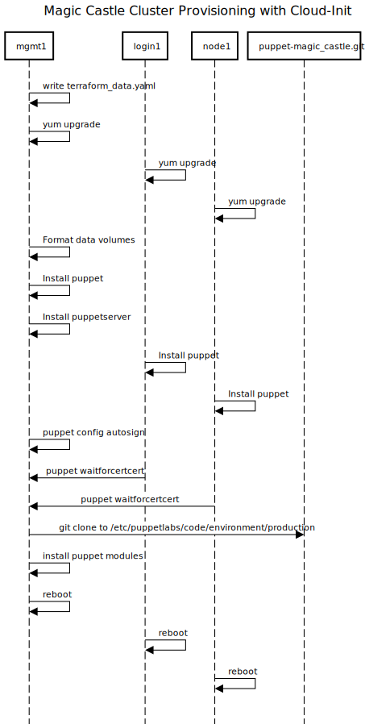

# Magic Castle Sequence Diagrams

The following sequence diagrams illustrate the inner working of Magic Castle
once `terraform apply` is called. Some details were left out of the diagrams,
but every diagram is followed by references to the code files that were used
to build it.

To limit the size of the diagram, the sequences represent a cluster composed
of one management node (`mgmt1`), one login node (`login1`) and one compute
node (`node1`). Clusters with multiple nodes each type would follow the same
sequences, repeated for each type.

## 1. Cluster Creation Sequence

### Notes

1. `puppet-magic_castle.git` does not have to refer to `ComputeCanada/puppet-magic_castle.git` repo.
Users can use their own fork. See the [developer documentation](/docs/developers.md) for more details.

### References

- [`magic_castle:/common/data.tf`](/common/data.tf)
- [`puppet-magic_castle:/data/terraform_data.yaml.tmpl`](https://github.com/ComputeCanada/puppet-magic_castle/blob/master/data/terraform_data.yaml.tmpl)
- [`magic_castle:/openstack/infrastructure.tf`](/openstack/infrastructure.tf)
- [`magic_castle:/dns/cloudflare/dns.tf`](/dns/cloudflare/dns.tf)
- [`magic_castle:/dns/acme/acme.tf`](/dns/acme/acme.tf)

## 2. Provisioning with Cloud-Init Sequence

### Notes

1. `puppet-magic_castle.git` does not have to refer to `ComputeCanada/puppet-magic_castle.git` repo.
Users can use their own fork. See the [developer documentation](/docs/developers.md) for more details.
2. While the diagram represents each step as completed sequentially, each node provisioning
is independent. The only step that requires synchronisation between nodes and the management node
is the puppet certificate generation.

### References

- [`magic_castle:/cloud-init/mgmt.yaml`](/cloud-init/mgmt.yaml)
- [`magic_castle:/cloud-init/puppet.yaml`](/cloud-init/puppet.yaml)

## 3. Provisioning with Puppet Sequence

